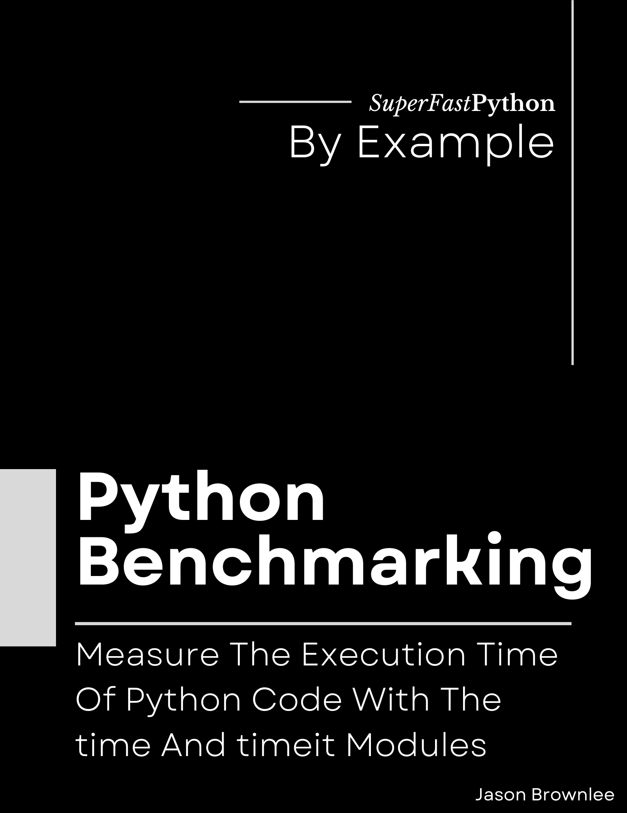

# Python Benchmarking Book

* <https://github.com/SuperFastPython/PythonBenchmarking>

This repository provides all source code for the book:

* **Python Benchmarking**: _Measure The Execution Time Of Python Code With The time And timeit Modules_, Jason Brownlee, 2023.

## Source Code
You can access all Python .py files directly here:

* [src/](src/)

## Get the Book
You can learn more about the book here:

* Coming Soon

### Book Blurb

> Python code can be slow.
>
> Benchmarking is a way of discovering exactly how long code takes to execute. It is also required to know whether changes made to the code make it execute faster.
>
> Without benchmarking, we are working in the dark.
>
> * Discover how to benchmark statements, functions, and programs using the time module.
> * Discover how to develop benchmarking helper functions, context managers, and decorators.
> * Discover how to benchmark snippets of code using the timeit API.
>
> Benchmarking is required to develop fast Python code.
>
> Python provides 5 built-in functions for reporting the current time. The problem is, that many developers use just one, the time() function, and are unaware of how inappropriate it is for benchmarking. Instead, we should be using the perf_counter() function.
>
> Python also provides the timeit module with API and command line interface specifically designed for benchmarking. It encodes best practices such as repeated execution of target code and use of a high-precision timing function. Nevertheless, few developers use it because it is confusing. The trick is to adopt the "timeit" mindset.
>
> Introducing: "Python Benchmarking". A new book designed to teach you how to bring modern benchmarking practices to your projects, super fast!
>
> You will get fast-paced tutorials showing you how to benchmark your Python code, as well as some much-needed advice on advanced topics, such as:
>
> * How to benchmark asyncio programs and coroutines.
> * How to choose the precision and units of measure when reporting benchmark results.
> * Why it is a good idea to repeat benchmark tests many times and report average results.
> * How profiling is not benchmarking but can help in deciding what to optimize.
>
> Each tutorial is carefully designed to teach one critical aspect of how to effectively benchmark Python code.
>
> Learn Python benchmarking correctly, step-by-step.

